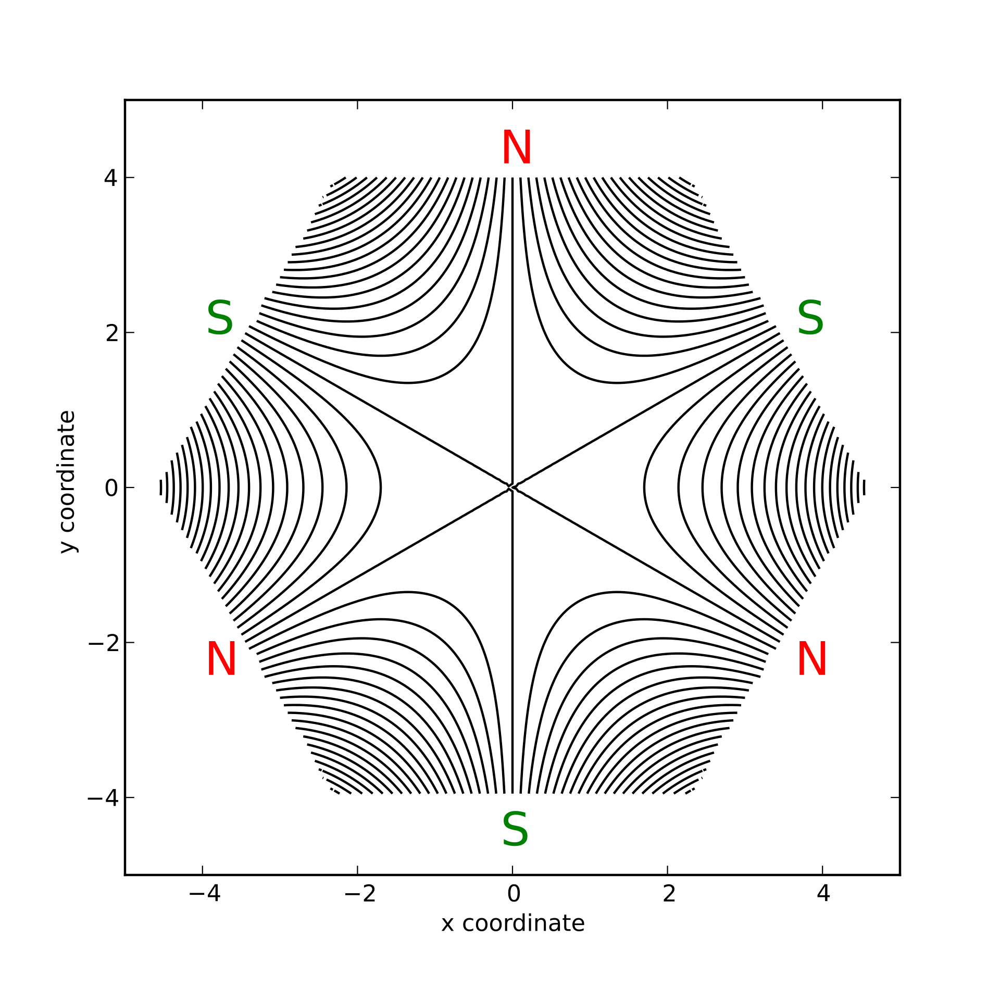
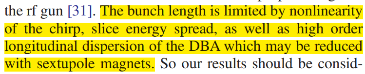

# Double Bend Achromat (DBA)

[TOC]

## $R_{56}是什么？$

$R_{56}$是一阶传输矩阵的5行6列的矩阵元，表示动能变化量$\delta_K$对粒子相对于参考粒子距离的影响。

### 六维相空间坐标

COSY的六个坐标分别是$x,a,y,b,l,\delta_K$。其中，
$$
\begin{aligned}
a & = p_x/p_0 \\
b & = p_y/p_0 \\
l & = -v_0 \frac{\gamma_0}{(1+\gamma_0)}(t-t_0) \\ 
  & = \kappa (t-t_0), \kappa = -v_0 \frac{\gamma_0}{(1+\gamma_0)} \\
\delta & = \frac{K-K_0}{K_0}
\end{aligned}
$$


### 一阶传输矩阵（也即线性部分）

$$
\begin{matrix}

\left(
\begin{array}{r}
x_0\\
a_0\\
y_0\\
b_0\\
l_0\\
\delta_0\\
\end{array}
\right)

=

\left(
\begin{array}{r}
(x|x) & (x|a) & (x|y) & (x|b) & (x|l) & (x|\delta) \\
(a|x) & (a|a) & (a|y) & (a|b) & (a|l) & (a|\delta) \\
(y|x) & (y|a) & (y|y) & (y|b) & (y|l) & (y|\delta) \\
(b|x) & (b|a) & (b|y) & (b|b) & (b|l) & (b|\delta) \\
(l|x) & (l|a) & (l|y) & (l|b) & (l|l) & (l|\delta) \\
(\delta|x) & (\delta|a) & (\delta|y) & (\delta|b) & (\delta|l) & (\delta|\delta) \\
\end{array}
\right)

\left(
\begin{array}{r}
x_1\\
a_1\\
y_1\\
b_1\\
l_1\\
\delta_1\\
\end{array}
\right)
\\


\end{matrix}
$$

#### 直线传输段

直线传输段的$R_{56}$应该是正的，这样本来正能量啁啾的电子束团才会因为传输段的$$
$$
\begin{matrix}
M_L = 
\left(
\begin{array}{r}
1 & L & 0 & 0 & 0 & 0 \\
0 & 1 & 0 & 0 & 0 & 0 \\
0 & 0 & 1 & L & 0 & 0 \\
0 & 0 & 0 & 1 & 0 & 0 \\
0 & 0 & 0 & 0 & 1 & D \\
0 & 0 & 0 & 0 & 0 & 1 \\
\end{array}
\right),
D = \frac{L}{(2+\eta_0)^2} \\

M_{L = 2} = 

\left(
\begin{array}{c}
1 & 2 & 0 & 0 & 0 & 0 \\
0 & 1 & 0 & 0 & 0 & 0 \\
0 & 0 & 1 & 2 & 0 & 0 \\
0 & 0 & 0 & 1 & 0 & 0 \\
0 & 0 & 0 & 0 & 1 & 0.166 \\
0 & 0 & 0 & 0 & 0 & 1 \\
\end{array}
\right),
D = \frac{L}{(2+\eta_0)^2} = \frac{1}{(2+(0.75/0.511))^2} \approx 0.166

\end{matrix}
$$

$$
\begin{matrix}

\end{matrix}
$$

```
     I  COEFFICIENT            ORDER EXPONENTS
     1   1.000000000000000       1   1 0  0 0  0 0
     2   2.000000000000000       1   0 1  0 0  0 0
     ---------------------------------------------
     I  COEFFICIENT            ORDER EXPONENTS
     1   1.000000000000000       1   0 1  0 0  0 0
     ---------------------------------------------
     I  COEFFICIENT            ORDER EXPONENTS
     1   1.000000000000000       1   0 0  1 0  0 0
     2   2.000000000000000       1   0 0  0 1  0 0
     ---------------------------------------------
     I  COEFFICIENT            ORDER EXPONENTS
     1   1.000000000000000       1   0 0  0 1  0 0
     ---------------------------------------------
     I  COEFFICIENT            ORDER EXPONENTS
     1   1.000000000000000       1   0 0  0 0  1 0
     2  0.1663196535473842       1   0 0  0 0  0 1
     ---------------------------------------------
     I  COEFFICIENT            ORDER EXPONENTS
     1   1.000000000000000       1   0 0  0 0  0 1
     ---------------------------------------------
```


#### 二极磁铁 Magnetic Dipole

有所谓的边缘磁场以及扇形和非扇形，展示不考虑

##### Sector Magnet

$$
M_D = 
\begin{matrix}
\left(
\begin{array}{c}
cos(\phi) & R_0 sin(\phi) & 0 & 0 & 0 & (x|\delta) \\
-sin(\phi)/R_0 & cos(\phi) & 0 & 0 & 0 & (a|\delta) \\
0 & 0 & 1 & R_0 \phi & 0 & 0 \\
0 & 0 & 0 & 1 & 0 & 0 \\
(l|x) & (l|a) & 0 & 0 & 1 & (l|\delta) \\
0 & 0 & 0 & 0 & 0 & 1 \\
\end{array}
\right)
\end{matrix} \\
(x|\delta) = -(l|a) = \frac{1+\eta_0}{2+\eta_0}R_0(1-cos(\phi)) \\
(a|\delta) = -(l|x) = \frac{1+\eta_0}{2+\eta_0}sin(\phi) \\
(l|\delta) = -R_0\left[ \frac{\eta_0}{2+\eta_0}\phi-\left( \frac{1+\eta_0}{2+\eta_0} \right)^2 sin(\phi) \right]
$$


#### The Quadrupole without Fringe Fields

$$
M_{MQ} = 

\begin{matrix}
\left(
\begin{array}{c}
cos(\omega L) & sin(\omega L)/\omega & 0 & 0 & 0 & 0 \\
-\omega sin(\omega L) & cos(\omega L) & 0 & 0 & 0 & 0 \\
0 & 0 & cosh(\omega L) & sinh(\omega L)/\omega & 0 & 0 \\
0 & 0 & \omega sinh(\omega L) & cosh(\omega L) & 0 & 0 \\
0 & 0 & 0 & 0 & 1 & D \\
0 & 0 & 0 & 0 & 0 & 1 \\
\end{array}
\right),
D = \frac{L}{(2+\eta_0)^2}, \omega = \sqrt{\frac{2M_{2,2}}{\chi_{m0}}}
\end{matrix}
$$


#### Sextupole Magnet

 


$$

$$

## 动量压缩因子是什么？


## 问题

1. 总的R56 = 0，那么不同能量的有相同的飞行时间偏差不变，那是谁去实现压缩的呢？中间三个四极铁是用来消色差的。
2. 之前了解过幅值抖动和相位抖动都是谁解决的
3. 


## 提升[^breaking 50fs]

1. nonlinearity of the chrip
2. slice energy spread
3. high order longitudinal dispersion of the DBA which may be reduced with sextupole magnets



### 那同样用DBA压缩的人遇到同样的问题了吗？他们用六极铁了吗？

其实除了DBA，还可以使用chicane压缩。反正怎么设计都可以，其实。

那我可以不可以设计一个呢？然后消高阶色差？


# Breaking 50 Femtosecond Resolution Barrier in MeV Ultrafast Electron Diffraction with a Double Bend Achromat Compressor[^breaking]


# Ref

[^breaking 50fs]:[Breaking 50 Femtosecond Resolution Barrier in MeV Ultrafast Electron Diffraction with a Double Bend Achromat Compressor (aps.org)](https://journals.aps.org/prl/pdf/10.1103/PhysRevLett.124.134803)

